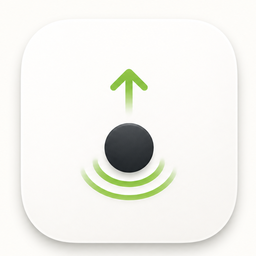
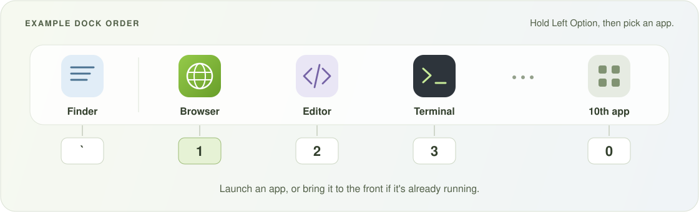

<p align="center">
  
</p>

<h1 align="center">Dock Tap</h1>

<p align="center">
  <strong>Keep your Mac awake. Let your agents work.</strong><br>
  Keep work running with the lid closed, and your everyday apps a shortcut away.
</p>

<p align="center">
  <a href="https://github.com/xavierliang/dock-tap/releases/latest"><strong>Download for macOS</strong></a>
  · <a href="#get-started">Get started</a>
  · <a href="docs/usage.md">User guide</a>
</p>

<p align="center">
  macOS 13+ · Apple silicon &amp; Intel · English &amp; 简体中文 · <a href="LICENSE">MIT license</a>
</p>

Agent tasks can take longer than you want to sit at your Mac. Dock Tap keeps your Mac awake — even with the lid closed — so system sleep doesn't interrupt agents, builds, or scripts running on your machine. Start a session, let your agent work, and come back when you're ready.

- **Keep your Mac awake for agent work.** Choose a one-hour session or indefinite mode for tasks with no clear finish time. Optionally prevent display idle sleep during the session, too.
- **Use the Dock you already know.** Shortcuts follow your pinned apps. Reorder your Dock, then open the Dock Tap menu to pick up the new order.
- **Choose your modifier.** Five physical key presets, including separate left and right Option and Command keys.
- **Arrange windows with the same modifier.** Snap to halves, maximize, or center the focused window.

Dock Tap lives in the menu bar, with Launch at Login and built-in update checks.

## Get started

1. [Download the latest release](https://github.com/xavierliang/dock-tap/releases/latest) and open `DockTap-<version>-universal.dmg`. Release builds are signed and notarized.
2. Drag **DockTap.app** to **Applications** and launch it from there.
3. Grant **Accessibility** access when prompted. Dock Tap uses it for app shortcuts and optional window resizing.
4. Under **Closed-Lid Keep Awake**, choose **Enable for 1 Hour** or **Enable Indefinitely**. Approve the helper if prompted, and wait for the menu to show an active session before closing the lid.

To try app switching, hold **Left Option** and press **1** to open your first pinned Dock app. Open **Dock Shortcut Bindings** to see all your mappings. You can also enable **Launch at Login** from the menu.

## Keep Awake for agent work

Give a coding agent time to work through a task, leave a build running, or let a script finish while you step away. **Keep Awake** prevents system sleep during your session, including when you close the lid. Leave Dock Tap running while the task runs.

Use the **Closed-Lid Keep Awake** controls in the menu, or these shortcuts with the default **Left Option** modifier:

| Hold Left Option, then press… | Action |
| --- | --- |
| <kbd>A</kbd> | Enable for 1 hour |
| <kbd>S</kbd> | Enable indefinitely |
| <kbd>D</kbd> | Stop now |

Choose one hour for a timed session, or indefinite mode when you don't know how long the task will take. Indefinite mode is remembered for the next launch. Normal quit stops the current session; **Stop Now** also clears the saved choice.

Enable **Keep Display Awake During Session** to prevent idle display sleep during an active session. It does not unlock your Mac or change its password requirements; agents that need an unlocked desktop can still be affected by screen locking. [Display and locking behavior →](docs/usage.md#keep-display-awake-during-session)

Closed-lid mode requires a privileged helper and may need approval in System Settings. It can increase battery drain and heat; use it on a ventilated surface. [Setup, session behavior, and recovery →](docs/usage.md#closed-lid-keep-awake)

## Your Dock, one shortcut away

Your favorite apps already have a place in the Dock. Dock Tap gives them a shortcut, too: hold **Left Option** and press **1–9 or 0** to open a pinned app or bring it to the front. The order in your Dock becomes the order on your keyboard.



All examples use the default **Left Option** key. Change it under **Shortcut Modifier** to Left Command, Left Control, Right Option, or Right Command; the same choice applies across all shortcuts.

| Hold Left Option, then press… | Action |
| --- | --- |
| <kbd>1</kbd> … <kbd>9</kbd> | Open or switch to pinned Dock apps 1–9 |
| <kbd>0</kbd> | Open or switch to the 10th pinned app |
| <kbd>`</kbd> | Switch to Finder |

Finder is separate from the numbered apps. Recent apps, folders, and Dock spacers do not take numbered slots. Dock Tap reads your Dock order at launch and whenever you open its menu.

### Put windows in place

Turn on **Enable Window Snap** in the menu to use these shortcuts. It is off by default.

| Hold Left Option, then press… | Action |
| --- | --- |
| <kbd>←</kbd> / <kbd>→</kbd> | Left / right half |
| <kbd>↑</kbd> / <kbd>↓</kbd> | Top / bottom half |
| <kbd>Return</kbd> | Maximize |
| <kbd>Space</kbd> | Center at 75% of the display's usable width and height |

Actions apply to the focused window on its current display. These shortcuts take over matching app or system shortcuts while Window Snap is enabled, including Option + arrow text navigation. Choose another modifier or toggle Window Snap off when needed. [More about window behavior and shortcut conflicts →](docs/usage.md#window-snap)

## Help and details

See the [user guide](docs/usage.md) for permissions, shortcut behavior, login settings, and troubleshooting. If something is not working, choose **Show Logs** from the menu and [open an issue](https://github.com/xavierliang/dock-tap/issues).

## Build from source

Requires macOS 13+ and a Swift 5.9+ toolchain. From the repository root, build and launch with a stable Apple Development signing identity:

```sh
DOCK_TAP_CODESIGN_IDENTITY="Apple Development: Your Name (TEAMID)" scripts/run-app.sh
```

This creates and launches `build/DockTap.app`. A stable signing identity keeps Accessibility authorization consistent across rebuilds. [Development signing details →](docs/usage.md#build-and-run)

## License

[MIT](LICENSE) — free to use, modify, and share.
